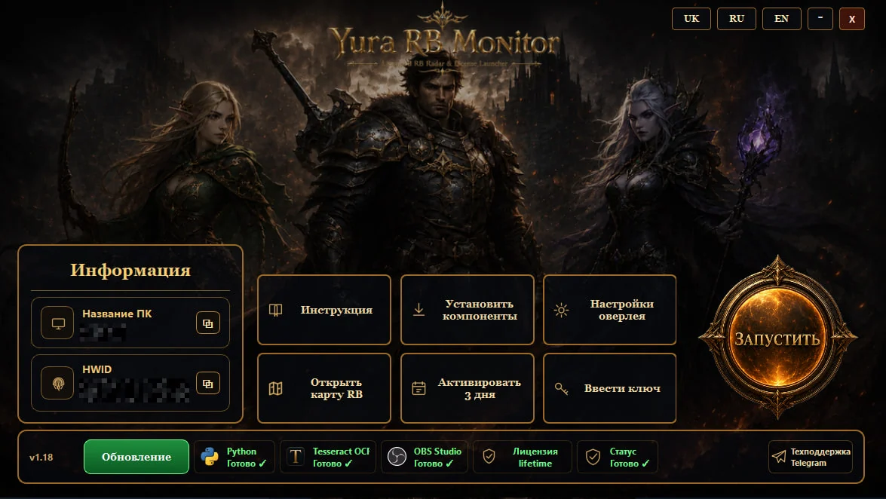
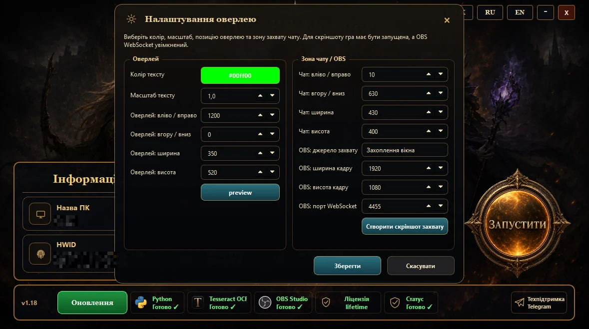
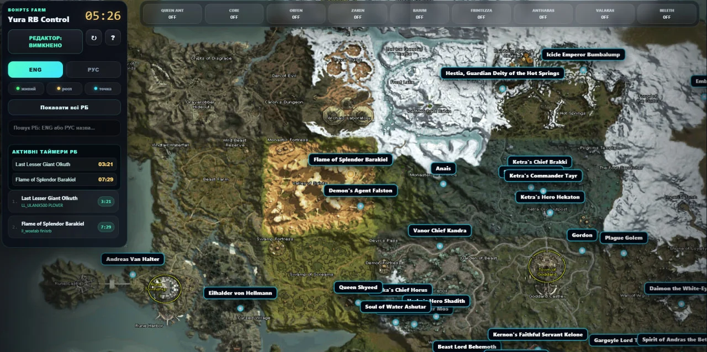
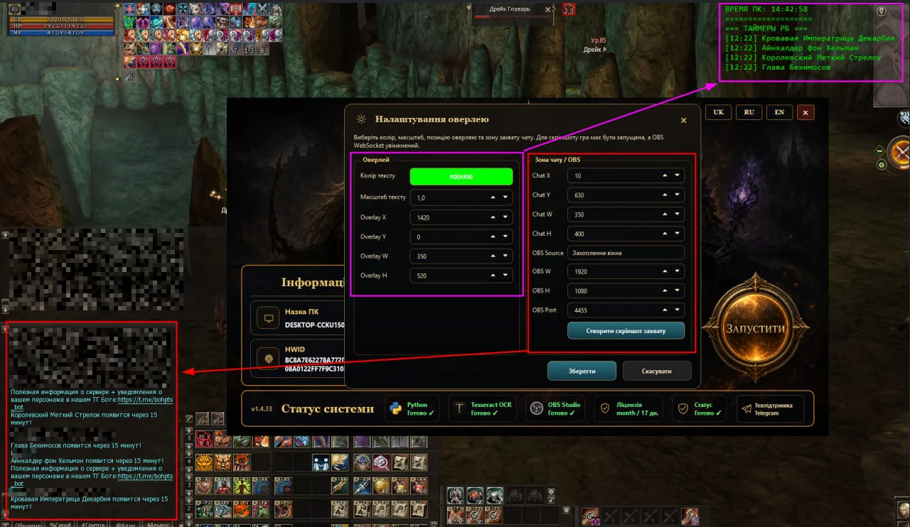

<div align="center">

# Yura RB Monitor

### Lineage II High Five Raid Boss Timer • OBS/OCR • Overlay • Live RB Map

[](https://github.com/Lineage-Script/Lineage2-RB-Monitor-BohPts/releases/latest)
[](https://github.com/Lineage-Script/Lineage2-RB-Monitor-BohPts/releases)
[](https://lineage-script.com/)
[](https://github.com/Lineage-Script/Lineage2-RB-Monitor-BohPts/releases/latest)

**[Website](https://lineage-script.com/) • [Download latest Windows build](https://github.com/Lineage-Script/Lineage2-RB-Monitor-BohPts/releases/latest/download/YuraRBMonitor_Client_latest.zip) • [Releases](https://github.com/Lineage-Script/Lineage2-RB-Monitor-BohPts/releases)**

</div>

---

## What is Yura RB Monitor?

**Yura RB Monitor** is a Windows companion tool for **Lineage II High Five** raid-boss tracking. It reads the visible system chat through **OBS + OCR**, detects raid-boss messages, starts respawn timers, shows an in-game overlay and synchronizes active bosses with an online RB map.

It is designed to reduce manual timer tracking while keeping the workflow focused on visible chat recognition and raid-boss information.

## Main features

- ⏱️ Raid Boss respawn timers
- 👁️ OBS + OCR system-chat recognition
- 🖥️ Configurable in-game timer overlay
- 🗺️ Shared online Raid Boss map
- 🔎 Boss search and live status
- 🌐 Ukrainian / Russian / English interface
- 🔑 Trial and licensed launcher access
- 📱 Mobile map access through QR linking

## Screenshots

### Launcher



### Overlay settings



### Raid Boss map



### OBS/OCR setup



## Download

### Latest Windows build

**[Download YuraRBMonitor_Client_latest.zip](https://github.com/Lineage-Script/Lineage2-RB-Monitor-BohPts/releases/latest/download/YuraRBMonitor_Client_latest.zip)**

After downloading:

1. Extract the ZIP completely.
2. Do not run the launcher directly from inside the archive.
3. Start `YuraRB_Launcher.exe`.
4. Install/check OBS, Python and Tesseract from the launcher if required.
5. Configure the OBS source and system-chat capture area.

## How it works

```text
Lineage II system chat
        ↓
OBS capture
        ↓
OCR recognition
        ↓
Raid Boss event detection
        ↓
Respawn timer
        ↓
Overlay + synchronized online RB map
```

## Website

https://lineage-script.com/

The website contains setup instructions, screenshots, feature descriptions and the current download link.

## Search keywords

Lineage 2, Lineage II, Lineage 2 High Five, Lineage II High Five, L2 High Five, Lineage 2 raid boss, L2 raid boss timer, raid boss respawn timer, RB Monitor, RB map, raid boss map, Lineage 2 map, OBS OCR, Tesseract OCR, Lineage 2 overlay, BoHpts, x500, Lineage 2 timer, карта РБ, таймер РБ, карта рейд боссов, таймер респа РБ.

---

<div align="center">

**Yura RB Monitor — less manual timer tracking, more raid-boss control.**

</div>
